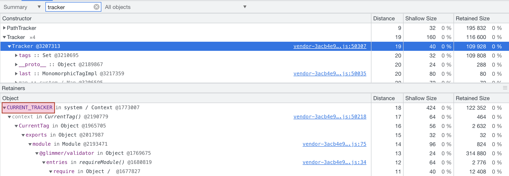

# Memory Leak Repro

## The Memory Leak

In a Fastboot SSR app, if there's an uncaught exception when a component is rendered on server side (e.g. error in the constructor or a getter), the `CURRENT_TRACKER` in `@glimmer/validator` will not be cleaned up / de-referenced properly. As a result, it won't be collected by GC and will keep consuming the `Tag`s from subsequent rendering. It'll keep growing until the process is killed because of OOM.

The steps to reproduce are below. I tried using Ember LTS (3.28) and latest (4.5). The issue exists in both versions.

## Steps To Reproduce

1. `yarn install`.
2. Start the server with prod build and Node debugger: `node --inspect ./node_modules/.bin/ember s --environment=production`. Dev build doesn't seem to have the same issue.
3. Visit http://localhost:4200.
4. Open Chrome DevTools for Node.js.
5. Take a heap snapshot (optional).
   - Search for `Tracker` in the "Class filter" input. You won't find any `Tracker` in the snapshot.
6. Visit http://localhost:4200/leak in anonther browser tab, or click the link on the page and *refresh the page*. The route has to be loaded and rendered on server side in Fastboot.
7. Visit http://localhost:4200/no-leak and refresh the page. You can refresh a few more times so the leak is a bit more obvious (I refreshed about 10 times before taking the snapshot in the screenshot below). You might not be able to tell there's a leak from the heap size itself, because this website is too simple.
8. Take another heap snapshot.
   - Search for `Tracker` in the "Class filter" input. You'll find some `Tracker` objects retained. Click on the one with the largest "retained size", and you'll find that is `CURRENT_TRACKER` in `@glimmer/validator`.

## Screenshot Of A Snapshot

